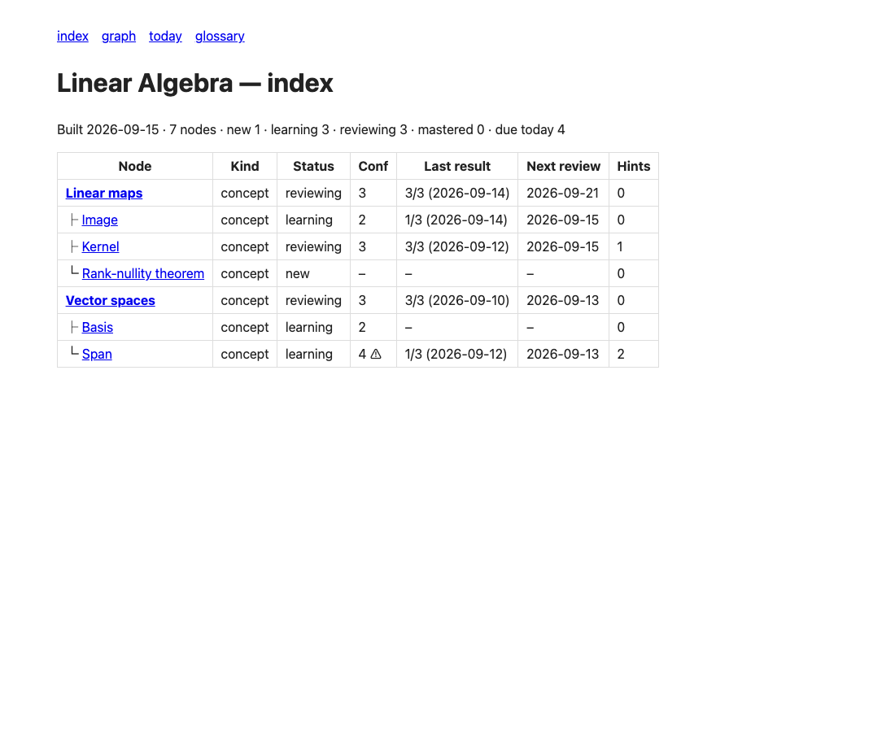
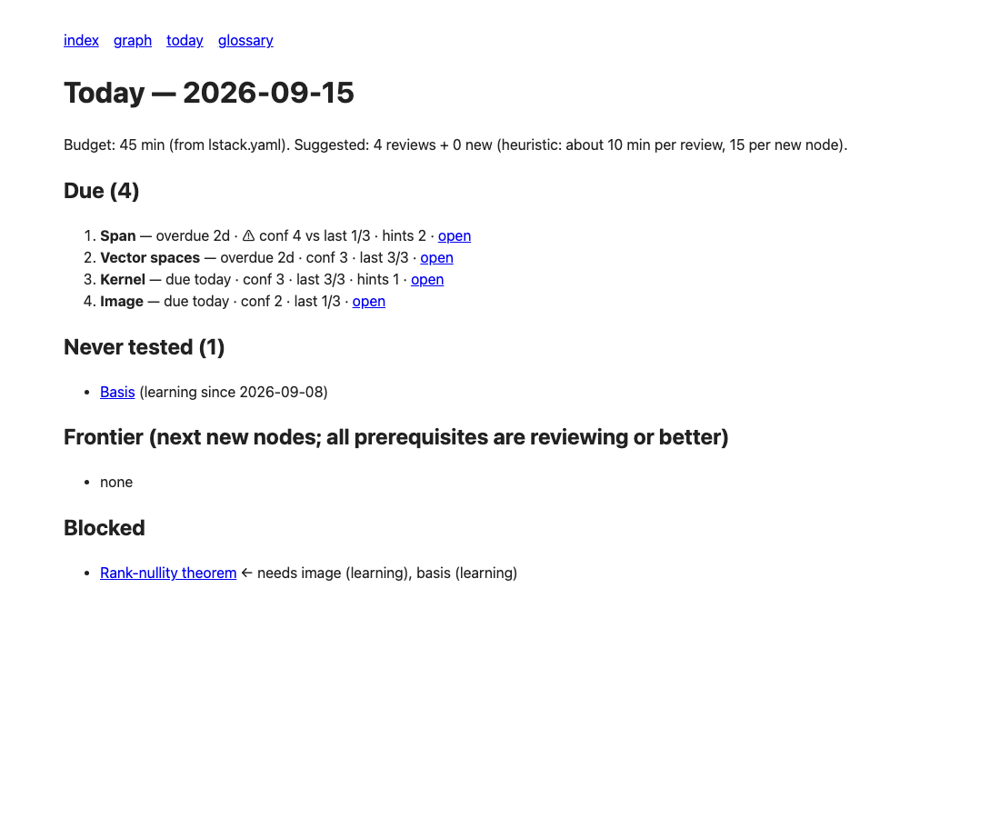
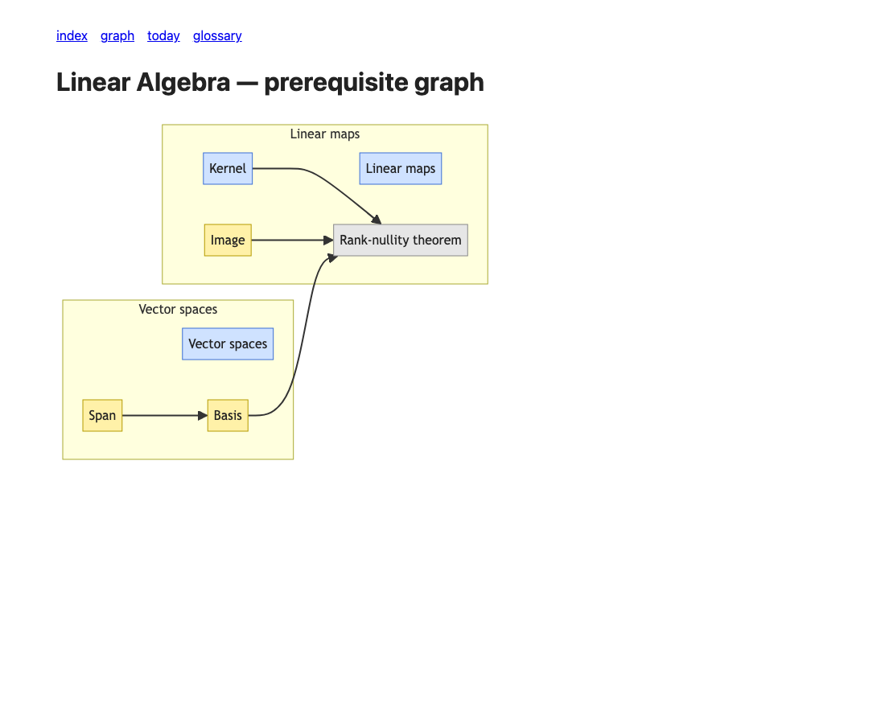

# lstack

Turn the coding agent you already use into a personal tutor over a folder of plain markdown.

You make an empty folder, install lstack, run `/setup-vault`, drop your sources in, and study with Claude Code, Cursor, Codex, Gemini CLI, Copilot, OpenCode, or Amp. The folder becomes a **vault**: one subject, every bit of state in markdown you can read and edit, a 550-line zero-dependency Node script that keeps the generated views in sync, and 23 skills that teach, test, and record. Nothing is written to the vault without being shown to you first.



## What makes it a tutor and not a chatbot

- **Status is evidence.** Every node has a `confidence` you set and a `status` that only a *delayed* test can move. Explaining, rereading, and same-day quizzes are recorded but never promote a node. The gap between what you think you know and what you have proven shows up as `⚠` in the index and first in today's queue.
- **Hints never reveal.** `/hint` climbs three rungs (point at the gap, name the tool, work a *different* example) and cycles. The answer lives behind a separate, deliberate `/give-up` that records a fail.
- **The graph knows what is next.** Prerequisite edges between nodes give you a frontier (new topics whose prerequisites you have proven) and a blocked list (what you would be wasting time on).
- **Spaced by a ladder.** 1, 3, 7, 16, 35 days, per node, configurable.
- **Show before write.** Every file change is previewed in full, frontmatter as before → after, body as `+`/`-` lines, and waits for your yes.

The research behind each rule is in [docs/LSTACK-SPEC.md](docs/LSTACK-SPEC.md), section 13.

## Install

Pick one per machine. Both installed yields duplicate skills.

```bash
# Cross-agent. Writes .agents/skills/<name>, symlinks .claude/skills/<name>.
npx skills add sscw32/lstack

# Claude Code only, namespaced as lstack:<name>.
claude plugins install lstack@sscw32/lstack
```

Run the install inside the folder that will become your vault, or once globally with `-g`.

## Five-minute walkthrough on the example vault

The repo ships a complete vault in `examples/linear-algebra/` (seven nodes, two branches, a few sessions of history). Open it with your agent and try the skills without setting anything up.

```bash
git clone https://github.com/sscw32/lstack && cd lstack/examples/linear-algebra
npx skills add sscw32/lstack     # or claude plugins install lstack@sscw32/lstack
```

1. **`/today`** reads the generated queue. On this fixture, dated 2026-09-15, it shows four nodes due (Span first, because you rated it a 4 and scored 1 of 3), one node never tested, nothing on the frontier, and Rank-nullity blocked behind Image and Basis.

   

2. **`/drill`** asks three questions per due node, mixed across branches, without telling you which node a question belongs to. Before each reveal it asks your confidence 1 to 4. After each node it previews the frontmatter change with the arithmetic (`next_review: 2026-09-15 → 2026-09-22 (delayed pass; ladder_days[2] = +7 days)`) and waits for yes.

3. **`/explain kernel intuition`** teaches from the cited source section, stops for a recall question, and ends with one retrieval question. It offers to move the node from `new` to `learning`.

4. **`/hint`** while you work `problems/sheet-1.md` question 3. Rung 1 is a question, rung 2 names the concept and the file, rung 3 works a different problem. It never touches `problems/attempts/`, which is yours.

5. **`/wrap-up`** gathers every pending change and the session log into one numbered preview, writes on yes, then runs `build` and `lint`.

6. **`/visualize`** serves the index, prerequisite graph, and node pages locally.

   

## Your own vault

```bash
mkdir stats && cd stats
npx skills add sscw32/lstack
# open your agent here and type:
/setup-vault
```

`/setup-vault` asks for the subject, waits while you drop material into `sources/`, asks why you are learning it (that becomes `MISSION.md`), proposes a two-level tree with prerequisite edges as a table and a Mermaid graph, lets you tune the tutor's voice and testing rules, and then shows every file it is about to write. One yes creates the vault.

## Layout of a vault

```text
<vault>/
├── AGENTS.md  CLAUDE.md  GEMINI.md   # tutor rules; the last two just import AGENTS.md
├── lstack.yaml                       # config: schedule, ladder, sections, voice
├── MISSION.md                        # why you are learning this
├── sources/                          # yours; the agent reads and cites, never edits
├── notes/                            # yours
├── kb/                               # nodes (kb/<id>.md, children in kb/<id>/) + generated views
├── log/                              # one file per session, append-only
├── problems/                         # sheets the agent may write; attempts/ it never touches
└── .lstack/                          # lstack.mjs, node-schema.md, card-writing.md, VERSION
```

Generated views (`index.md`, `graph.md`, `glossary.md`, `analogies.md`, `heuristics.md`, `today.md`) are rebuilt by `node .lstack/lstack.mjs build`. Nodes are the truth.

## Skills

| Skill | What it does |
|---|---|
| `/setup-vault` | Create a vault here from your sources |
| `/today` | Show the queue and budget, hand off |
| `/drill` | Today's interleaved, topic-blind review |
| `/quiz <node>` | Scoped test, topic known |
| `/recall <node>` | Free recall, then hit/miss/wrong |
| `/teach-back <node>` | You teach a naive student persona |
| `/into-the-woods <node>` | The fine print your notes skip |
| `/explain <node> [plain\|intuition\|formal]` | Teach from sources, end with retrieval |
| `/why-care <node>` | Write the "Why it matters" section |
| `/cards <node>` | Propose 5 to 15 Obsidian-syntax cards |
| `/hint` | Escalating hints, never the answer |
| `/give-up` | The answer, recorded as a fail |
| `/add-source <file>` | Propose nodes and edits from new material |
| `/check-source <file>` | Report suspected errors, never edit |
| `/split <node>` | Children beside the parent, parent untouched |
| `/lint-vault` | Structural lint plus a contradiction read |
| `/log-session` | Record study done away from the agent |
| `/wrap-up` | One batch preview, one log file, build, lint |
| `/progress` | Counts, gaps, streak, what changed |
| `/roast` | A PG roast from your own numbers |
| `/voice` | Change register, verbosity, humor, bluntness, testing rules |
| `/visualize` | Local read-only server |
| `/bro` | Say that again, simpler |

Cards use the Obsidian Spaced Repetition plugin's syntax, so a vault opened in Obsidian reviews the same cards.

## Script

```bash
node .lstack/lstack.mjs build              # rebuild the six generated views
node .lstack/lstack.mjs lint               # LEVEL path: message; exit 1 on any ERROR
node .lstack/lstack.mjs due [--json]       # the queue
node .lstack/lstack.mjs serve [--port N]   # local server
node .lstack/lstack.mjs version
```

Add `--today YYYY-MM-DD` to any command to pin the date.

## Developing lstack

See [AGENTS.md](AGENTS.md) for layout, conventions, and the three test commands. The build decisions and every deviation from the spec are in [docs/decisions.tsv](docs/decisions.tsv). Cross-agent notes are in [docs/portability.md](docs/portability.md).

MIT.
