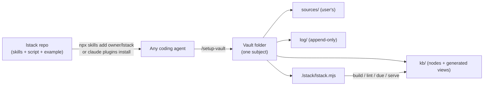
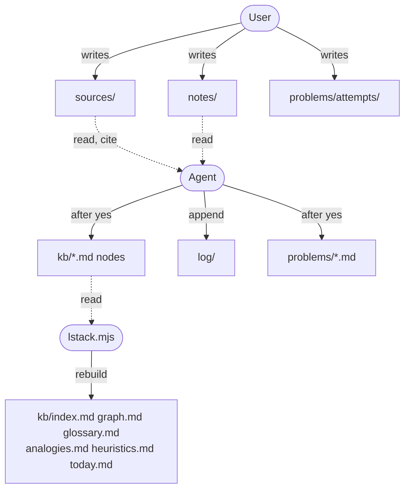
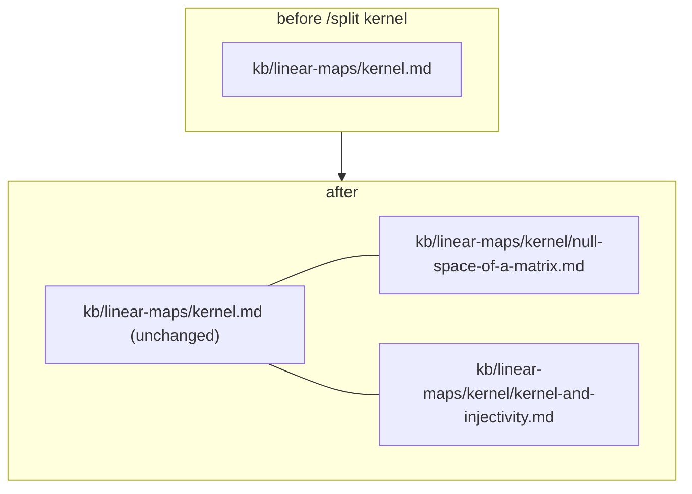
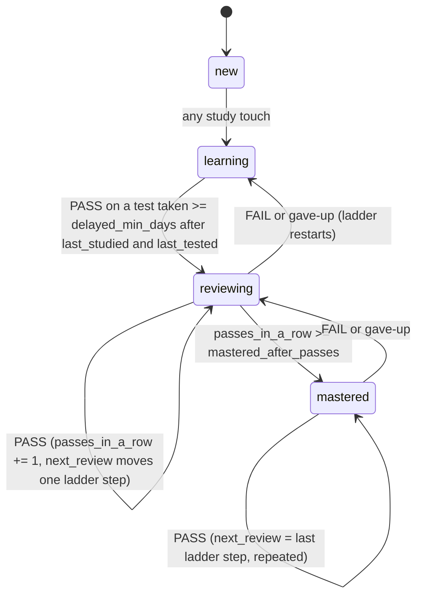
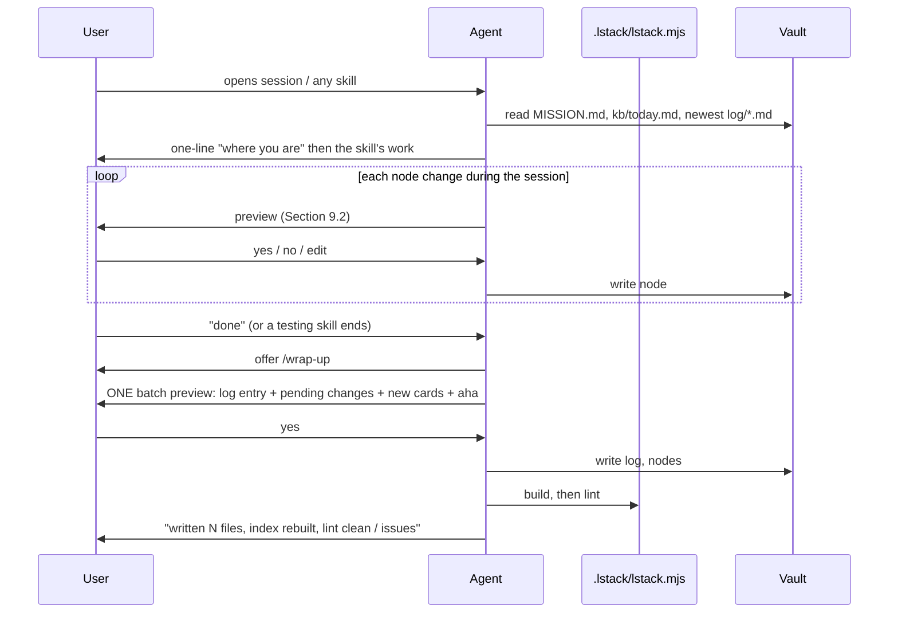

# lstack: implementation specification

**Purpose of this document.** This is a complete, self-contained build spec for *lstack*, a pack of markdown skills that turns any coding agent (Claude Code, Cursor, Codex CLI, Gemini CLI, GitHub Copilot, OpenCode, Amp) into a personal tutor over a folder of plain markdown files. An agent given only this file should be able to build the whole thing from scratch. Every decision below was made deliberately; where a decision looks odd, the reason is stated next to it. Do not "improve" a stated decision without flagging it.

**How to read this.** Sections 1-3 are the contract. Sections 4-9 are the on-disk formats (exact). Section 10 is the build script. Section 11 is the skills, one by one. Section 12 is the build order with acceptance tests. Section 13 is the research behind the rules, so you can judge edge cases in the same spirit.

**Placeholders you must fill or ask about:** `<owner>` (GitHub handle of the repo owner), and the real subject of the owner's first private vault used for testing (Section 12.8).

---

## 1. What lstack is

A user creates an empty folder, installs lstack, runs `/setup-vault`, drops their sources in, and studies with whatever agent they already use. The folder becomes a **vault**: one subject, all state in markdown, a small zero-dependency script that keeps generated views in sync, and a set of skills that teach, test, and record. Nothing is ever written to the vault without being shown to the user first.



### 1.1 Learning principles and the mechanism that implements each

| Principle (owner's words) | Mechanism in lstack |
|---|---|
| Know what you know and don't know | Two separate fields per node: `confidence` (set only by the user) and `status` (moved only by test evidence). The gap between them is surfaced in `today.md` and `/progress`. |
| Know *why* you don't know | Prerequisite edges. `/hint` exits to "go review node X". `/log-session` and `/drill` record which prerequisite failed. |
| Test what you don't know | `status` cannot advance without a delayed, unaided test. Reading, explaining, or summarizing never counts. |
| Analogies help | `## Analogies` section on every node, aggregated into a generated `analogies.md`. |
| A proper path, like a graph | Folder tree for organization plus `prereqs:` edges for order. `today.md` proposes the next "frontier" node whose prerequisites are all proven. |
| Space out learning | Review ladder 1, 3, 7, 16, 35 days, applied per node, configurable in `lstack.yaml`. |
| If you can explain it you understand it | `/teach-back`, `/recall`. Every `/explain` ends with one retrieval question. |
| Build intuition | `/explain intuition`, `/why-care`, `## Heuristics` section aggregated into `heuristics.md`. |
| No answers before an attempt | `/hint` never reveals. `/give-up` is a separate, deliberate act that records a fail. The agent never writes into `problems/attempts/`. |
| What context is missing | `/lint-vault` and `/check-source` report gaps and contradictions. `/add-source` proposes new nodes from new material. |

### 1.2 Non-negotiable constraints

1. **Show before write.** Every write to the vault is previewed in full (Section 9.2 format) and requires an explicit yes. Single-node edits confirm inline. End-of-session edits batch into one `/wrap-up` preview.
2. **Folder ownership.** Each folder has an owner (Section 5.2). Skills respect it; `lint-vault` checks it.
3. **Portable.** No hooks, no output styles, no sub-agent dependency (role-play runs in the same thread), no `$ARGUMENTS`, scripts are Node 18+ with zero npm dependencies. Always-on rules live in `AGENTS.md` with one-line import shims for Claude Code and Gemini CLI.
4. **Status is evidence.** `status` moves only on a test taken at least `delayed_min_days` after the node's last study or test. Self-report never moves it.
5. **Generated files are disposable.** Only the script writes them. Nobody hand-edits them. Nodes are the truth.

---

## 2. Repository layout

```text
lstack/
├── README.md                        # what it is, install, 5-minute walkthrough using examples/
├── LICENSE                          # MIT
├── AGENTS.md                        # for agents working ON this repo (conventions, how to test)
├── CLAUDE.md                        # exactly: @AGENTS.md
├── .gitignore                       # .agents/  .claude/  node_modules/  .DS_Store
├── .claude-plugin/
│   ├── plugin.json                  # {"name":"lstack","version":"0.1.0","description":"...","author":{"name":"<owner>"}}
│   └── marketplace.json             # {"name":"lstack","plugins":[{"name":"lstack","source":"./","description":"..."}]}
├── examples/
│   └── linear-algebra/              # a complete 6-node vault; fixture for script tests and README screenshots
├── skills/
│   ├── setup-vault/
│   │   ├── SKILL.md
│   │   ├── agents/openai.yaml       # Codex display manifest (every skill has one)
│   │   ├── scripts/lstack.mjs       # THE build script; setup-vault copies it into the vault
│   │   ├── references/
│   │   │   ├── node-schema.md       # Section 6, verbatim, copied into vault/.lstack/
│   │   │   ├── card-writing.md      # Section 6.6 rubric, copied into vault/.lstack/
│   │   │   ├── agents-md-template.md
│   │   │   └── lstack-yaml-template.md
│   │   └── tests/                   # node --test; runs the script against ../../examples/linear-algebra
│   ├── drill/SKILL.md
│   ├── ... one folder per skill (23 total, Section 11)
│   └── bro/SKILL.md
└── docs/
    └── design-contract.md           # the decision record (optional, for humans)
```

**Why flat `skills/<name>/`.** Both the `npx skills` installer and the Claude Code plugin loader find skills at exactly this depth without a manifest listing.

**Why the script lives inside `setup-vault`.** The installer allows subset installs (`-s drill`). Any skill that needs the script uses the *vault's* copy at `.lstack/lstack.mjs`, never a path into another skill's folder. `setup-vault` is the only skill that needs the script in its own folder, because it is the one that installs it.

**Why `.agents/` and `.claude/` are gitignored.** The owner's working copy contains third-party dev skills there. The installer scans `.agents/skills/` and `.claude/skills/` in a repo, so shipping them would expose those skills as part of lstack.

### 2.1 Install paths (what the user runs)

```bash
npx skills add <owner>/lstack          # cross-agent: writes .agents/skills/<name>, symlinks .claude/skills/<name>
```

```bash
claude plugins install lstack@<owner>/lstack   # Claude Code only, namespaced as lstack:<name>
```

Tell users to pick one per machine. Both installed yields duplicates.

### 2.2 Per-skill files

Every `skills/<name>/` contains:

- `SKILL.md` with frontmatter using only `name`, `description`, and (for user-only skills) `disable-model-invocation: true`. Claude Code, Cursor, and Copilot honor the third key; other agents ignore it harmlessly. No other keys.
- `agents/openai.yaml`:

```yaml
interface:
  display_name: "Drill"
  short_description: "Run today's spaced review"
# for user-only skills add:
# policy:
#   allow_implicit_invocation: false
```

- `description` always begins with `In an lstack learning vault (a folder containing lstack.yaml), ...` followed by trigger phrases. This stops agents that auto-invoke from firing `/quiz` when someone mentions a quiz feature in an unrelated project.
- Arguments: no `$ARGUMENTS`. The body says: "The text after the skill name in the user's message is the argument. If there is none, ask."
- Every SKILL.md under 200 lines. Long material goes in `references/`.

---

## 3. Cross-agent portability facts (verified 2026-09-15)

| Agent | Reads project skills from | Reads `.agents/skills/` | User invokes | Always-on file |
|---|---|---|---|---|
| Claude Code | `.claude/skills/` | no (installer symlinks) | `/name` | `CLAUDE.md` (import `@AGENTS.md`) |
| Cursor | `.cursor/skills/`, `.agents/skills/`, `.claude/skills/` | yes | `/name` | `AGENTS.md` |
| Codex CLI | `.agents/skills/` (and parents) | yes | `$name` or `/skills` | `AGENTS.md` |
| Gemini CLI | `.gemini/skills/`, `.agents/skills/` | yes | model activates, user confirms | `GEMINI.md` (import `@AGENTS.md`) |
| Copilot | `.github/skills/`, `.claude/skills/`, `.agents/skills/` | yes | `/name` in prompt | `AGENTS.md` |
| OpenCode | `.opencode/skills/`, `.claude/skills/`, `.agents/skills/` | yes | model calls `skill` | `AGENTS.md` |
| Amp | `.agents/skills/`, `.claude/skills/` | yes | by name | `AGENTS.md` |

Consequences baked into this spec: `AGENTS.md` is the vault's instruction file; `/setup-vault` writes `CLAUDE.md` and `GEMINI.md` each containing the single line `@AGENTS.md`; skills never rely on sub-agents, hooks, or argument substitution.

---

## 4. Vault layout

```text
<vault>/
├── AGENTS.md            # persona, fixed rules, session rules (Section 9.1)
├── CLAUDE.md            # exactly: @AGENTS.md
├── GEMINI.md            # exactly: @AGENTS.md
├── lstack.yaml          # config (Section 4.1)
├── MISSION.md           # why the user is learning this (Section 4.2)
├── sources/             # USER-OWNED raw material
├── kb/                  # nodes + generated views
│   ├── index.md         # generated
│   ├── graph.md         # generated
│   ├── glossary.md      # generated
│   ├── analogies.md     # generated
│   ├── heuristics.md    # generated
│   ├── today.md         # generated
│   ├── linear-maps.md   # a top-level node
│   └── linear-maps/     # its children
│       ├── kernel.md
│       ├── kernel/      # kernel's children, if it was split
│       │   └── ...
│       ├── image.md
│       └── rank-nullity.md
├── notes/               # USER-OWNED free-form notes; optional overview.md
├── log/                 # one file per session, append-only
├── problems/
│   ├── <sheet>.md       # agent may write
│   └── attempts/        # agent NEVER writes here
└── .lstack/
    ├── lstack.mjs       # build script, copied by /setup-vault
    ├── node-schema.md
    ├── card-writing.md
    └── VERSION          # e.g. 0.1.0
```

### 4.1 `lstack.yaml`

Written by `/setup-vault`. Read by every skill and by the script. Hand-editable.

```yaml
lstack: 0.1.0                 # version of the pack that created this vault
subject: linear-algebra       # slug; prefixes node IDs when a hub aggregates vaults
title: Linear Algebra
created: 2026-09-15

schedule:                     # used by /today to size the queue
  sessions_per_week: 4
  minutes_per_session: 45

scheduling:                   # Section 8
  ladder_days: [1, 3, 7, 16, 35]
  pass_threshold: 0.67
  delayed_min_days: 1
  mastered_after_passes: 3

node_sections:                # Section 6.4; Summary and Cards are required
  - Summary
  - Why it matters
  - Terms
  - Analogies
  - Heuristics
  - Aha
  - Open questions
  - Cards

voice:                        # Section 9.3; what /setup-vault or /voice recorded
  register: casual
  verbosity: terse
  humor: some
  bluntness: direct

overview: false               # true if notes/overview.md was requested
node_available: true          # result of `node --version` at setup
```

### 4.2 `MISSION.md`

Free prose, three headings, written by `/setup-vault` from the user's answers and editable by the user:

```markdown
# Mission
## Why
## What success looks like
## Constraints and dates
```

Every planning skill (`/setup-vault`, `/today`, `/add-source`, `/progress`) reads it first.

---

## 5. Ownership

### 5.1 Who writes where

| Path | Agent may write | Rule |
|---|---|---|
| `sources/` | never | Read and cite only. `/check-source` reports, never edits. |
| `kb/<node>.md` | after a yes | One preview per node edit, or batched in `/wrap-up`. |
| `kb/` generated files | script only | Rebuilt by `build`. Never hand-edited. |
| `notes/` | never | Agent reads; may *propose* promoting text into a node. |
| `log/` | append only | New file per session. Never rewrite an existing log. |
| `problems/*.md` | after a yes | Sheets, no solutions inside. |
| `problems/attempts/` | never | The user's work. Structural "no answers" guarantee. |
| `.lstack/` | `/setup-vault` only | Version-checked by lint. |
| `AGENTS.md`, `lstack.yaml`, `MISSION.md` | `/setup-vault`, `/voice` | After a yes. |

### 5.2 Ownership diagram



---

## 6. Nodes

### 6.1 Path rules

- A node is a file `<path>/<id>.md` inside `kb/`.
- If a node has children, they live in a folder `<path>/<id>/` **beside** the file (not inside it). Any depth.
- `id` = filename without `.md`. Lowercase, `a-z0-9-`, unique across the whole vault. Duplicates are a lint error.
- `parent` is **derived from the path** (name of the enclosing folder, or none at top level). It is not a frontmatter field. Skills and the script compute it.
- Splitting a node (`/split`): create `<path>/<id>/`, write children there. The parent file is untouched. No moves, no ID changes, prereq edges keep resolving.



### 6.2 Frontmatter schema

```yaml
---
id: kernel                       # required; equals filename
kind: concept                    # concept | fact | procedure  (decides the default test type)
status: learning                 # new | learning | reviewing | mastered   (Section 8)
confidence: 3                    # 1-4, set ONLY by the user, never by the agent on its own
last_studied: 2026-09-01         # last explain/read/study touch
last_tested: 2026-09-03          # last test of any kind
last_result: 1/3                 # "n/m" | pass | fail | gave-up | null
next_review: 2026-09-06          # date; null if never tested
passes_in_a_row: 0               # consecutive passes at ladder spacing
hint_count: 2                    # lifetime hints on this node
prereqs: [image, basis]          # node IDs; may cross branches; empty list allowed
sessions: [2026-09-01, 2026-09-03]   # dates the node was touched (the "instances learned")
sources:                         # citations; "agent-proposed" marks a guess
  - "Axler, Linear Algebra Done Right, 3A"
  - agent-proposed
---
```

Field rules:

- `confidence`: only a user statement changes it. Skills ask "confidence 1-4?" and record the answer.
- `status`, `last_tested`, `last_result`, `next_review`, `passes_in_a_row`: changed only by testing skills (`/drill`, `/quiz`, `/recall`, `/teach-back`, `/into-the-woods`, `/give-up`) and by `/log-session` when it grades evidence. See Section 8.
- `hint_count`: incremented by `/hint`, never decremented.
- `sessions`: appended by any skill that touched the node, at `/wrap-up`.
- `kind` defaults: `concept` for ideas (test by explain/apply), `fact` for definitions and formulas (test by recall), `procedure` for methods (test by performing on a fresh problem).

### 6.3 Status state machine



Same-day tests (less than `delayed_min_days` after the last study or test) are recorded in the log and in `last_result` but **do not change `status`**. The agent says so explicitly: "Recorded, but this doesn't count toward status because you studied it today."

### 6.4 Body sections

Headings are fixed by `node_sections:` in `lstack.yaml` (default list below). Order as listed. Missing sections are simply absent. `Summary` and `Cards` are required for every node with `status != new`.

```markdown
# Kernel

## Summary
What it is, in the user's own words once they have them. Agent-written at first, marked "(agent draft)" until the user rewrites or approves.

## Why it matters
Written by /why-care.

## Terms
- kernel :: the set of vectors T sends to 0
- null(T) :: notation for the kernel of T

## Analogies
- Kernel is the "shadow" of what T flattens away.

## Heuristics
- When asked if T is injective, check whether ker T = {0} first.

## Aha
- 2026-09-03: kernel size and injectivity are the same question.

## Open questions
- Why does dim ker T + dim range T equal dim V exactly?

## Cards
What is the kernel of a linear map T::The set {v in V : Tv = 0}
Is T injective if ker T = {0}?
?
Yes. Injective iff ker T = {0}.
The kernel of T is a ==subspace== of the domain V.
```

Format rules the script relies on:

- `## Terms` entries: one per line, `- term :: definition`. Formulas allowed as the term.
- `## Analogies`, `## Heuristics`: one bullet per entry.
- `## Aha`: `- YYYY-MM-DD: text`.
- `## Cards`: Obsidian spaced-repetition plugin syntax (Section 6.6).

### 6.5 Generated views

All begin with `<!-- GENERATED by .lstack/lstack.mjs build on <ISO date>. Do not hand-edit. -->`.

**`kb/index.md`**

```markdown
# Linear Algebra — index
Built 2026-09-15 · 9 nodes · new 4 · learning 3 · reviewing 2 · mastered 0 · due today 2

| Node | Kind | Status | Conf | Last result | Next review | Hints |
|---|---|---|---|---|---|---|
| **Linear maps** | concept | learning | 3 | – | – | 0 |
| ├ [Kernel](linear-maps/kernel.md) | concept | reviewing | 4 | 3/3 (2026-09-10) | 2026-09-13 | 2 |
| │ ├ [Null space of a matrix](linear-maps/kernel/null-space-of-a-matrix.md) | procedure | new | – | – | – | 0 |
| ├ [Image](linear-maps/image.md) | concept | learning | 2 | 1/3 (2026-09-12) | 2026-09-13 | 0 |
```

Tree order = folder order, depth shown with box-drawing prefixes. A `⚠` after the confidence when confidence ≥ 3 and the last result ratio < `pass_threshold` (the calibration gap).

**`kb/graph.md`**: one Mermaid `flowchart LR`. One `subgraph` per top-level node. Edge `prereq --> dependent`. `classDef` per status (new grey, learning yellow, reviewing blue, mastered green). Node label = title. Click-free.

**`kb/glossary.md`**: every `## Terms` entry across nodes, alphabetical, `- **term** :: definition — [Kernel](linear-maps/kernel.md)`.

**`kb/analogies.md`**, **`kb/heuristics.md`**: same shape, grouped by node in tree order.

**`kb/today.md`**: Section 8.3.

### 6.6 Cards

Syntax (compatible with the Obsidian Spaced Repetition plugin, so a vault opened in Obsidian reviews the same cards):

- Single line: `Question::Answer`
- Reversible: `A:::B`
- Multi-line: question lines, a line containing only `?`, answer lines. Reversible multi-line uses `??`.
- Cloze: `==hidden text==` inside a sentence.
- The plugin appends `<!--SR:!date,interval,ease-->` after cards it schedules. lstack ignores and preserves these comments.

Card-writing rubric (`references/card-writing.md`, enforced by `/cards` and checked loosely by lint):

- One idea per card. No yes/no questions. No card whose answer is a verbatim sentence from the Summary.
- Concept nodes get at least two cards with different lenses (definition, contrast with a neighbor, when to use, a consequence).
- Procedure nodes get at least one "given this input, what's the first step" card.
- Five to fifteen cards per node. If you can't write two, the node is probably a `fact`.
- Every card the agent proposes goes through show-before-write.

---

## 7. Sessions and logs

### 7.1 Log file

`log/YYYY-MM-DD-<n>.md`, `<n>` starting at 1 per day. Written by `/wrap-up` or `/log-session`. Never rewritten.

```markdown
---
date: 2026-09-15
session: 1
mode: agent            # agent | offline
skills: [drill, hint, explain]
nodes: [kernel, image]
minutes: 40
---
## Covered
## Questions the user asked
- "why is the kernel a subspace?" → explained via closure under addition
## Results
- kernel: 3/3 → pass (delayed) → status reviewing, next_review 2026-09-18
- image: 1/3 → fail → status learning, next_review 2026-09-16
## Aha
- image: "the image is just the span of the columns" (also written to image.md)
## Changes written
- kb/linear-maps/kernel.md (frontmatter, Aha)
- kb/linear-maps/image.md (frontmatter)
## Open threads
```

The "Questions the user asked" section is the owner's requested "page with all my LLM queries", distributed across logs; `/progress` can concatenate them on request.

### 7.2 Session lifecycle



---

## 8. Scheduling

### 8.1 Rules (defaults in `lstack.yaml`)

- **Pass**: correct fraction ≥ `pass_threshold` (default 0.67) of the questions asked in that test, judged by the agent against the node's Summary, Cards, and sources. For `/teach-back`, pass = the agent's student persona declares itself convinced. For `/recall`, pass = the user's free recall covered the Summary's key points (agent lists what was hit and missed).
- **Delayed**: `today - max(last_studied, last_tested) >= delayed_min_days`. Only delayed tests move `status`.
- **Ladder**: on a delayed PASS, first `passes_in_a_row += 1`, then `next_review = today + ladder_days[min(passes_in_a_row, len(ladder_days) - 1)]`. So the first pass schedules +3 days, the second +7, the third +16 (and reaches mastered), then +35 repeating. `ladder_days[0]` (1 day) is used only after a fail, a gave-up, a hint pull, or a first study. On FAIL or gave-up: `passes_in_a_row = 0`, `next_review = today + ladder_days[0]`, status drops one step.
- **Hints**: each `/hint` increments `hint_count`; if `next_review` is more than `ladder_days[0]` away, pull it to `today + ladder_days[0]`.
- **Mastered**: `passes_in_a_row >= mastered_after_passes` while reviewing.

The agent computes these dates itself when it proposes the node edit (simple date arithmetic), and the user sees the date in the preview. The script does not schedule; it only reads `next_review`.

### 8.2 Calibration gap

`gap = 1 if confidence >= 3 and last_result ratio < pass_threshold, else 0`. Shown as `⚠` in index, sorted first in `today.md`, and the raw material for `/roast` and `/progress`.

### 8.3 `today.md` queue

Generated by `build` (and printed by `due`).

```markdown
# Today — 2026-09-15
Budget: 45 min (from lstack.yaml). Suggested: 3 reviews + 1 new.

## Due (3)
1. **Kernel** — overdue 6d · ⚠ conf 4 vs last 1/3 · hints 2 · [open](linear-maps/kernel.md)
2. **Image** — due today · conf 2 · last 3/3
3. **Span** — overdue 1d

## Never tested (2)
- Basis (learning since 2026-09-08)
- Linear independence

## Frontier (next new nodes; all prerequisites are reviewing or better)
- Rank-nullity theorem ← kernel, image, basis

## Blocked
- Diagonalization ← needs eigenvalues (learning), basis (learning)
```

Ordering of Due: gap first, then overdue days descending, then hint_count descending. Frontier = `status: new` nodes whose every prereq has status ≥ reviewing (or no prereqs). Blocked = new nodes with an unproven prereq, showing which. Budget line = `minutes_per_session`; suggested counts = roughly 10 min per review, 15 per new node (a heuristic, stated as such).

**v2 (not now):** repetition compression, where passing a dependent credits its prerequisites. Deliberately excluded to keep node state small.

---

## 9. `AGENTS.md`, previews, voice

### 9.1 `AGENTS.md` template (written by `/setup-vault`)

```markdown
# This folder is an lstack learning vault

Subject: Linear Algebra. Config in lstack.yaml. Why I'm learning this: MISSION.md.

## Before you say anything
Read MISSION.md, kb/today.md, and the newest file in log/. Open with one line on where I am.

## Writing to this vault
- Show the exact content of any file you intend to write or change, then wait for my explicit yes. No exceptions, including "small" edits.
- sources/, notes/, problems/attempts/ are mine. Read them, never edit them.
- kb/index.md, graph.md, glossary.md, analogies.md, heuristics.md, today.md are generated. Never edit them; run `node .lstack/lstack.mjs build` after node changes.
- log/ is append-only. One new file per session.
- Node files follow .lstack/node-schema.md. Cards follow .lstack/card-writing.md.

## Testing me
- `status` only moves on a test taken at least one day after I last studied or was tested on that node. Same-day results are recorded but don't count. Say so when it happens.
- Ask my confidence (1-4) before revealing any answer.
- Never do the task for me in a testing or practice skill. /hint never reveals; only /give-up does.
- Never confirm a wrong answer, even if I push back or say my notes agree with me. Explain why it's wrong.
- Praise the work, not me.
- End every explanation with one retrieval question.
- In /drill, don't announce the topic of a question.

## Voice
<filled from lstack.yaml voice: register, verbosity, humor, bluntness; one short paragraph>

## Ending a session
When I say I'm done, or when a testing skill ends, offer /wrap-up.
```

The block under "Testing me" is the research-backed default. `/setup-vault` shows it and lets the user change any line; if a change contradicts the evidence, the agent says so once (one sentence, with the finding), then writes what the user asked.

### 9.2 Preview format (every write)

```markdown
### Proposed write 1 of 2: kb/linear-maps/kernel.md
**Frontmatter**
- status: learning → reviewing
- last_tested: 2026-09-03 → 2026-09-15
- last_result: 1/3 → 3/3
- next_review: 2026-09-06 → 2026-09-18   (passes_in_a_row 1 → ladder_days[1] = +3 days)
- passes_in_a_row: 0 → 1
**Body**
+ ## Aha
+ - 2026-09-15: injectivity and a trivial kernel are the same question

### Proposed write 2 of 2: log/2026-09-15-1.md (new file)
<full contents>

Reply **yes** to write all, **no** to skip all, or name what to change.
```

For a brand-new file, show the full contents. For an edit, show frontmatter as before → after and body as `+`/`-` lines. Never summarize a write as "updated kernel.md".

### 9.3 Voice options (asked by `/setup-vault`, changed by `/voice`)

| Key | Options | Default |
|---|---|---|
| register | formal, casual | casual |
| verbosity | terse, balanced, thorough | terse |
| humor | none, some, lots | some |
| bluntness | gentle, direct, harsh | direct |

Plus the "Testing me" lines, each individually editable.

---

## 10. The build script `lstack.mjs`

Single ES module, Node 18+, zero dependencies, ≤ 600 lines, `node .lstack/lstack.mjs --help`. Exit code 0 on success, 1 on lint findings (for `lint`), 2 on a usage or parse error.

### 10.1 Commands

| Command | Reads | Writes | Output |
|---|---|---|---|
| `build` | every `kb/**/*.md` node, `lstack.yaml` | the six generated files | one line per file written |
| `lint` | same | nothing | findings, one per line: `LEVEL path: message` |
| `due [--json]` | same | nothing | the Due, Never tested, Frontier lists (or JSON) |
| `serve [--port 4173]` | vault | nothing | local HTTP server rendering index, graph, node pages |
| `version` | `.lstack/VERSION` | nothing | version string |

### 10.2 Parsing rules (hand-rolled, deliberately minimal)

- Frontmatter: the block between the first line `---` and the next line `---`. Keys `key: value`. Values: unquoted scalar, `"quoted"`, `[a, b, c]` inline list, or a block list of `- item` lines. `null`, integers, `YYYY-MM-DD` dates recognized. Anything else is a string. Nested maps only one level (needed for `lstack.yaml`).
- Node discovery: walk `kb/` recursively; a node is any `.md` that is not one of the six generated filenames. `id` from filename; `parent` from the directory name if the directory is not `kb/`; depth from path.
- Body sections: split on lines starting `## `. Section names compared case-insensitively against `node_sections`.
- Cards: within `## Cards`, count `::` lines, `?`/`??` blocks, and `==...==` occurrences. Preserve `<!--SR:...-->` comments.

### 10.3 Lint rules

| Level | Rule |
|---|---|
| ERROR | duplicate `id` across the vault |
| ERROR | `prereqs` entry names a non-existent id |
| ERROR | `id` in frontmatter ≠ filename |
| ERROR | a folder `<x>/` exists in `kb/` with no sibling `<x>.md` |
| ERROR | prereq cycle |
| WARN | node with status ≠ new but no `## Summary` or no cards |
| WARN | `next_review` in the past (report days overdue) |
| WARN | calibration gap (Section 8.2) |
| WARN | file in `sources/` cited by no node |
| WARN | node cited by no other node's prereqs and with no children and not top-level (orphan) |
| WARN | card syntax that is none of the four forms |
| WARN | `.lstack/VERSION` older than the version in `lstack.yaml` or the installed skill |
| INFO | node with `agent-proposed` in sources (unverified tree) |

### 10.4 `serve`

Static server, no build step. `/` renders `index.md`; `/graph` renders `graph.md` with Mermaid; `/node/<id>` renders that node's markdown. Uses `marked` and `mermaid` from a CDN in the browser only (the script itself has no dependencies). Read-only. `/visualize` runs this.

### 10.5 Tests

`skills/setup-vault/tests/*.test.mjs` using `node --test`. Fixture: `examples/linear-algebra/`. Assertions: `build` produces byte-identical expected `index.md`, `graph.md`, `glossary.md`, `today.md` (with a fixed `--today 2026-09-15` flag for determinism); `lint` on the clean fixture returns 0 findings; a mutated fixture (duplicate id, dangling prereq, cycle, missing sibling file) returns exactly the expected findings.

---

## 11. Skills

### 11.0 Conventions every skill follows

1. Frontmatter: `name`, `description` (starts with the vault prefix, then "Use for ..." trigger phrases, then "Skip when ..." exclusions), optional `disable-model-invocation: true`.
2. First body line: what the skill does and when, no preamble. Imperatives addressed to the agent.
3. Preconditions: "Confirm `lstack.yaml` exists in the working directory or a parent. If not, say this isn't a vault and suggest `/setup-vault`."
4. Read `MISSION.md`, `kb/today.md`, newest log before acting (unless the skill is `/bro`).
5. Every write follows Section 9.2. Every skill that writes nodes ends with: run `node .lstack/lstack.mjs build`, then `lint`, report the one-line result. If `node_available: false`, rebuild `index.md` and `today.md` by hand and say so.
6. Any skill that tests: ask confidence 1-4 before revealing; apply Section 8; state whether the result counts toward status.
7. Other skills are referenced by slash name (`/drill`), never by path.
8. No sub-agents, no hooks, no `$ARGUMENTS`.

Skills marked **user-only** carry `disable-model-invocation: true` and `allow_implicit_invocation: false`.

### 11.1 `/setup-vault` (user-only)

Creates a vault in the current folder. Refuse if `lstack.yaml` already exists (point to `/add-source`).

Steps, in order, each a short exchange:

1. Check `node --version`. Record `node_available`. If missing, say the vault will work but index rebuilding will be slower and less reliable.
2. Ask the subject name. Derive `subject` slug and `title`.
3. Create `sources/` and ask the user to put their material in it now (syllabus, table of contents, lecture list, notes, PDFs, links in a `.md`). Wait. List what was found. If nothing: say the tree will be agent-proposed and every node marked as such, and continue.
4. Mission: ask why, what success looks like, any dates. Write `MISSION.md` (preview first).
5. Schedule: sessions per week, minutes per session.
6. Division: ask "How should the content be divided? (a) follow the sources' own chapters/sections (default), (b) by concept, (c) you tell me." Then derive the tree: two levels by default, each node with `kind`, `prereqs`, `sources`. Show it as a table (id, title, kind, prereqs, source) plus a Mermaid prereq graph. Iterate until the user says yes. Ask whether any subtopic should be split further now.
7. Voice: show the Section 9.3 table and the "Testing me" defaults. Record changes; give the one-time evidence note if a default is weakened.
8. Node sections: show the default list, allow add/remove/rename; keep Summary and Cards.
9. Ask whether to create `notes/overview.md` (a hand-written narrative page; explain it is never authoritative).
10. Show the complete plan of files to be written as one preview: folder tree, `AGENTS.md`, `CLAUDE.md`, `GEMINI.md`, `lstack.yaml`, `MISSION.md`, every node file (status `new`, Summary "(agent draft)" from the sources, no cards yet), `.lstack/` contents. One yes.
11. Write. Run `build`, `lint`. Print next steps: `/today`, `/explain <node>`, `/drill`.

### 11.2 `/voice` (user-only)

Show the current Voice block and "Testing me" lines from `AGENTS.md`, ask what to change, preview, write `AGENTS.md` and the `voice:` block in `lstack.yaml`.

### 11.3 `/today`

Run `due --json`. Present the queue with reasons and the budget. If the user picks an item, hand off to the matching skill (`/drill` for reviews, `/explain` for a frontier node). No writes.

### 11.4 `/progress`

Read all nodes (via `due --json` plus index). Report: counts per status, calibration gaps ranked, nodes with most hints, streak of sessions (from log dates), what changed since the last `/progress` (compare to the newest log's "Results"). Optionally concatenate all "Questions the user asked" from logs on request. No writes.

### 11.5 `/add-source`

Argument: a file in `sources/` (or list uncited ones from lint). Read it. Propose: new nodes (with ids, kinds, prereqs, sources), edits to existing nodes (new terms, new cards, new prereq edges), and where each goes in the tree. Show as a table plus Mermaid diff (new nodes/edges highlighted). Wait for yes. Write. `build`, `lint`.

### 11.6 `/check-source`

Argument: a file in `sources/` or `notes/`, or a node. Read it against the user's other sources and the agent's knowledge. Report suspected errors, each with: the claim, why it looks wrong, what the other source says, confidence (low/medium/high). Never edit the file. Offer to add an `## Open questions` entry to the related node (preview, yes).

### 11.7 `/split`

Argument: a node id. Propose children (ids, kinds, prereqs among themselves, which parts of the parent's Summary move where). Preview shows the new folder and files; the parent file is unchanged except an optional line in Summary pointing to children. Yes, write, `build`, `lint`.

### 11.8 `/lint-vault`

Run `lint`. Then the agent's own pass: read nodes in the same branch and report contradictions between Summaries, terms defined differently in two nodes, prereqs that look backwards. For each fix, preview per node. `build` after any write.

### 11.9 `/explain`

Argument: a node id (or a phrase, resolved to a node, else "no node yet, want me to propose one via /add-source?") and an optional mode `plain | intuition | formal` (default from voice; `plain` if unset). Read the node and its sources. Explain in at most ~5 paragraphs; for `intuition` lead with the analogy and the "when would you use this" question; for `formal` use the source's definitions and notation. Every three to five paragraphs, stop and ask one recall or self-explanation question before continuing. End with one retrieval question. Set `last_studied`, append to `sessions`, and offer to save any new analogy or term to the node (preview). Mark `status: new → learning` (preview).

### 11.10 `/why-care`

Argument: node id. Write a `## Why it matters` section: what this unlocks, what breaks without it, where it shows up later in this vault (name dependents from the graph) and outside it. Preview, yes, `build`.

### 11.11 `/bro` (user-only)

Body, verbatim: "Restate your last message. Stop using jargon and speak coherently. State it more simply and concisely, like one human talking to another." No reads, no writes.

### 11.12 `/visualize` (user-only)

Run `node .lstack/lstack.mjs serve` and tell the user the URL. If `node` is missing, say so and point at `kb/index.md` and `kb/graph.md` instead.

### 11.13 `/drill` (the daily driver)

1. Run `due --json`. Take the Due list up to the session budget. Interleave: never two consecutive questions from the same node; shuffle across branches.
2. For each node: pick 3 questions, at least one from `## Cards` and at least one freshly generated at the node's `kind`-appropriate level (fact → recall, concept → explain or contrast, procedure → perform on a fresh instance). Do not say which node a question belongs to.
3. Per question: ask; ask confidence 1-4; then reveal and judge. Be explicit about wrong answers.
4. Per node: compute pass/fail, whether it is delayed, the new status and `next_review` per Section 8. Preview the node edit inline, yes, write.
5. At the end: offer `/wrap-up`.

### 11.14 `/quiz`

Argument: node id or branch. Same question mechanics as `/drill` steps 2-4 but scoped, 5-10 questions, topic known. Offer `/wrap-up`.

### 11.15 `/recall`

Argument: node id. Say "Write everything you remember about X. Don't look anything up. Say done when finished." Do not interrupt. Then compare against Summary, Terms, and Cards: list hit, missed, and wrong, each in one line. Judge pass/fail (Section 8). Preview the node edit. Offer to add missed items as cards (preview).

### 11.16 `/teach-back`

Argument: node id. Play a curious student who does not know the topic, in the same thread. Ask naive questions, ask for examples, ask "why" until the explanation bottoms out in something the student accepts, and push on anything vague or wrong ("wait, you said X earlier"). Stay in character until convinced or until the user stops. Then drop character: list where the explanation was strong, where it broke, pass/fail. Preview node edit. Each break point becomes a proposed card.

### 11.17 `/into-the-woods`

Argument: node id. Read the node's sources. Ask about details the Summary and Cards do *not* cover: edge cases, conditions in a theorem's statement, the step in a proof that is usually skipped, notation subtleties. 5 questions, confidence before reveal. Result counts as a test. Offer to add what was missed to `## Open questions` or as cards.

### 11.18 `/cards`

Argument: node id. Read Summary, Terms, sources, existing cards. Propose 5-15 cards following `card-writing.md`, in Obsidian syntax, avoiding duplicates. Preview, yes, write into `## Cards`. `build`, `lint`.

### 11.19 `/hint`

Argument: the problem the user is stuck on (pasted or referenced) and, if not obvious, the node. Read `hint_count`. Rung = `(hint_count mod 3) + 1` counted from the start of this problem (track within the session; the persisted counter decides where the next problem starts):

1. A question that points at the gap.
2. Name the concept or theorem that applies, and where it is in the vault (`kb/...`).
3. A fully worked example of a *different* problem of the same type.

Then cycle back to 1. Never state the answer or a step that is specific to the user's problem. If the user says they got it, ask them to state the answer and confirm or correct it; record as a test result only if delayed. Increment `hint_count` and pull `next_review` (Section 8.1), preview, write. If the user asks for the answer, say "that's `/give-up`".

### 11.20 `/give-up` (user-only)

Reveal the full answer to the current problem with a short explanation. Preview a node edit: `last_result: gave-up`, status drops one step, `next_review = today + ladder_days[0]`. Log it. Say which prerequisite node to review next.

### 11.21 `/log-session`

Argument: free text describing what the user studied outside the agent, optionally with pasted evidence (solved problems, a written explanation, an image). 

- From the description alone: propose `sessions` entries, `last_studied`, a `confidence` update if the user stated one, new sources, aha lines, notes, and any new nodes discovered. Never `status`.
- If evidence is present and gradable: grade it against the node's sources, show the grading (what was right, what was wrong, the ratio), and treat it as a test result under Section 8 (including the delayed rule). Preview the status change.
- After a description-only log: offer a two-minute check right now (three questions) to earn a status change.
- Write a `mode: offline` log entry. Preview everything, yes, write, `build`, `lint`.

### 11.22 `/wrap-up` (user-only)

Gather everything pending from this session: node edits not yet written, aha moments mentioned, questions the user asked, results. Build the log entry (Section 7.1). Show ONE batch preview (Section 9.2, numbered). Accept yes, or per-item edits. Write. `build`, `lint`. Report.

### 11.23 `/roast` (user-only)

Read index and `due --json`. Deliver a short, funny, PG roast using only the user's own data: calibration gaps ("rated Kernel a 4, scored 1 of 3, bold"), overdue counts, hint counts, streaks. No writes. Respect `humor: none` by refusing politely.

---

## 12. Build order and acceptance tests

Do the phases in order. Each phase ends with its tests passing and a one-line status in `AGENTS.md` of the repo.

### Phase 0: skeleton

- Repo layout (Section 2), manifests, `.gitignore`, `LICENSE`, README stub.
- `examples/linear-algebra/`: a full vault per Section 4 with six nodes: `vector-spaces` (children `span`, `basis`), `linear-maps` (children `kernel`, `image`, `rank-nullity`). Prereqs: basis ← span; rank-nullity ← kernel, image, basis. Mixed statuses and dates around 2026-09 so `today.md` has content. Include expected generated files.
- Accept: `npx skills add ./` from a scratch folder installs 23 skill folders; `claude plugins validate` (or equivalent) passes.

### Phase 1: script

- `lstack.mjs` per Section 10 with tests.
- Accept: `node --test skills/setup-vault/tests` green; `build` on the example is byte-identical to the checked-in expected files; `serve` renders index, graph, and a node page in a browser.

### Phase 2: vault creation

- `references/*` templates, `/setup-vault`, `/add-source`, `/split`, `/lint-vault`, `/today`, `/progress`, `/visualize`.
- Accept: in a scratch folder with one syllabus file in `sources/`, `/setup-vault` produces a vault that passes `lint` with 0 errors; `/add-source` on a second file proposes nodes and writes only after yes; `/split` leaves the parent file byte-identical.

### Phase 3: explaining and hints

- `/explain`, `/why-care`, `/bro`, `/hint`, `/give-up`, `/cards`.
- Accept: `/hint` across 5 consecutive asks produces rungs 1,2,3,1,2 and never a problem-specific step (manual check); `hint_count` increments on disk; `/give-up` writes `gave-up` and drops status; `/cards` output passes lint's card check.

### Phase 4: testing skills

- `/drill`, `/quiz`, `/recall`, `/teach-back`, `/into-the-woods`.
- Accept: a same-day test is recorded but leaves `status` unchanged and the agent says so; a next-day pass moves learning → reviewing with `passes_in_a_row: 1` and `next_review = today + 3` shown in the preview before writing; `/drill` never announces the topic; confidence is asked before every reveal.

### Phase 5: sessions and extras

- `/wrap-up`, `/log-session`, `/voice`, `/roast`, `/check-source`.
- Accept: `/wrap-up` produces exactly one batch preview and one new log file; `/log-session` with a description only never changes `status`; with a pasted solved problem it shows grading before proposing a status change.

### Phase 6: docs and cross-agent smoke test

- README with the example vault walkthrough and screenshots from `serve`.
- Run the same three actions (`/setup-vault`, `/explain`, `/drill`) in Claude Code, Cursor, and Codex. Record differences in `docs/portability.md`.

### 12.7 Skill trigger tests (every skill)

Per the create-skill discipline: for each skill, one in-scope prompt must fire it and one just-out-of-scope prompt must not (for example "make me a quiz component in React" must not fire `/quiz`). Fix misfires by editing the `description`, not the body.

### 12.8 Real-vault testing

The owner keeps a private vault on their real subject (**ask the owner which subject and what sources they have**). After each phase, run the new skills there. A skill is done when it has been used on the real vault at least once and the owner confirmed the preview-then-write behavior.

---

## 13. Research basis (why the rules are what they are)

- Rereading and explanations inflate confidence while lowering retention; delayed testing wins. Roediger & Karpicke 2006. https://pubmed.ncbi.nlm.nih.gov/16507066/ → status moves only on delayed tests.
- Free recall beats concept mapping. Karpicke & Blunt 2011. https://www.science.org/doi/10.1126/science.1199327 → `/recall` exists and `/explain` ends with retrieval.
- Storage vs retrieval strength; practice performance is a poor index of learning. Bjork. https://bjorklab.psych.ucla.edu/research/ → same-day results don't count.
- Forgetting curve replication. Murre & Dros 2015. https://journals.plos.org/plosone/article?id=10.1371/journal.pone.0120644 → ladder 1, 3, 7, 16, 35.
- Interleaving RCT, d = 0.83. Rohrer et al. 2020. https://gwern.net/doc/psychology/spaced-repetition/2019-rohrer.pdf → `/drill` interleaves and is topic-blind.
- Overconfidence and retention. Dunlosky & Rawson 2012. https://www.sciencedirect.com/science/article/pii/S0959475211000685 → confidence before reveal, calibration gap.
- Unrestricted AI help raised practice scores and lowered exam scores; hints-only erased the harm. Bastani et al. PNAS 2025. https://www.pnas.org/doi/10.1073/pnas.2422633122 → `/hint` never reveals.
- Tutor sycophancy under pushback. https://arxiv.org/abs/2605.14604 → never confirm a wrong answer.
- Person-praise harms performance. Kluger & DeNisi 1996 (via https://github.com/kubilaiswf/claude-tutor) → praise the work.
- Knowledge-graph spaced repetition and the frontier. Skycak / Math Academy. https://www.justinmath.com/individualized-spaced-repetition-in-hierarchical-knowledge-structures/ → prereq edges, frontier, blocked list.
- Card writing. Matuschak. https://andymatuschak.org/prompts/ and Nielsen https://augmentingcognition.com/ltm.html → card rubric.
- Escalating hints with a persisted counter. Rosche. https://benrosche.com/the-socratic-tutor-an-ai-tutor-that-asks-instead-of-answers/ → `hint_count`, rungs.
- Obsidian spaced-repetition syntax. https://stephenmwangi.com/obsidian-spaced-repetition/flashcards/q-and-a-cards/ → card format.
- Agent Skills spec and per-agent skill directories. https://agentskills.io/specification and vendor docs → Section 3.
- Vercel skills installer behavior. https://github.com/vercel-labs/skills → Section 2.1.
- Matt Pocock's `teach` skill (MISSION.md, "never trust parametric knowledge"). https://github.com/mattpocock/skills → `MISSION.md`, sources-first setup.
- pstack's `bro` skill (seven-line user-only corrective). → `/bro`.

---

## 14. Explicitly out of scope for v1

- Calendar integration (MCP is not portable across agents).
- A skill for authoring new skills (point users at existing tools in the README).
- Multi-subject vaults or a hub (node IDs are namespaced by `subject` so a hub can come later).
- Repetition compression / credit propagation across prereq edges.
- Per-card scheduling (the node is the unit; Obsidian's plugin can schedule cards independently).
- FSRS or any adaptive algorithm (fixed ladder, configurable).

## 15. Glossary of terms used here

- **Vault**: a folder containing `lstack.yaml`; one subject.
- **Node**: one markdown file in `kb/` representing a topic at any depth.
- **Branch**: a node that has children in a same-named sibling folder.
- **Generated view**: one of the six files the script rebuilds.
- **Delayed test**: a test at least `delayed_min_days` after the node's last study or test.
- **Frontier**: `new` nodes whose prerequisites are all `reviewing` or better.
- **Calibration gap**: high confidence with a failing last result.
- **Preview**: the before/after listing shown before any write (Section 9.2).
- **User-only skill**: cannot be auto-invoked by the model.
