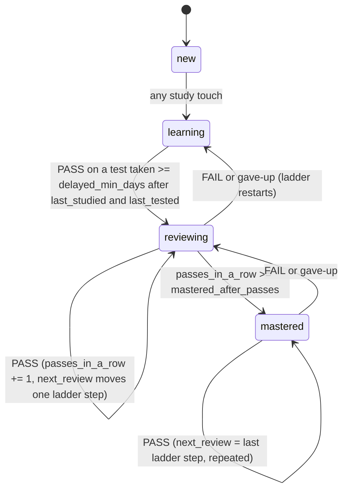

# Node schema

A node is one markdown file under `kb/`. This file is the contract the build script reads and every skill writes against.

## Path rules

- A node is a file `<path>/<id>.md` inside `kb/`.
- If a node has children, they live in a folder `<path>/<id>/` beside the file, not inside it. Any depth.
- `id` is the filename without `.md`. Lowercase, `a-z0-9-`, unique across the whole vault. A duplicate is a lint error.
- `parent` is derived from the path (the enclosing folder's name, or none at top level). It is not a frontmatter field.
- Splitting a node creates `<path>/<id>/` and writes children there. The parent file is untouched. No moves, no id changes.
- `kb/index.md`, `graph.md`, `glossary.md`, `analogies.md`, `heuristics.md`, `today.md` are generated. Any other `.md` under `kb/` is a node.
- Tree order is folder order (alphabetical by filename), depth first.

## Frontmatter

```yaml
---
id: kernel                       # required; equals filename
kind: concept                    # concept | fact | procedure  (decides the default test type)
status: learning                 # new | learning | reviewing | mastered
confidence: 3                    # 1-4, set ONLY by the user, never by the agent on its own; null until asked
last_studied: 2026-09-01         # last explain/read/study touch
last_tested: 2026-09-03          # last test of any kind
last_result: 1/3                 # "n/m" | pass | fail | gave-up | null
next_review: 2026-09-06          # date; null if never tested
passes_in_a_row: 0               # consecutive passes at ladder spacing
hint_count: 2                    # lifetime hints on this node
prereqs: [image, basis]          # node ids; may cross branches; empty list allowed
sessions: [2026-09-01, 2026-09-03]   # dates the node was touched
sources:                         # citations; "agent-proposed" marks a guess
  - "axler-toc.md 3.B Null Spaces and Ranges"
  - agent-proposed
---
```

Field rules:

- `confidence`: only a user statement changes it. Skills ask "confidence 1-4?" and record the answer.
- `status`, `last_tested`, `last_result`, `next_review`, `passes_in_a_row`: changed only by testing skills (`/drill`, `/quiz`, `/recall`, `/teach-back`, `/into-the-woods`, `/give-up`) and by `/log-session` when it grades evidence.
- `hint_count`: incremented by `/hint`, never decremented.
- `sessions`: appended by any skill that touched the node, at `/wrap-up`.
- `kind` defaults: `concept` for ideas (test by explain or apply), `fact` for definitions and formulas (test by recall), `procedure` for methods (test by performing on a fresh problem).
- `sources`: a citation counts as citing a file in `sources/` when the entry contains that file's name (for example `axler-toc.md`). Lint warns about a source file no node cites.

## Status state machine



Same-day tests (less than `delayed_min_days` after the last study or test) are recorded in the log and in `last_result` but do not change `status`. Say so explicitly: "Recorded, but this doesn't count toward status because you studied it today."

## Scheduling arithmetic (defaults in `lstack.yaml`)

- Pass: correct fraction >= `pass_threshold` (default 0.67). Note that 2 of 3 is 0.667 and does not pass at 0.67; lower the threshold to 0.66 if two of three should pass.
- Delayed: `today - max(last_studied, last_tested) >= delayed_min_days`.
- Ladder on a delayed PASS: `passes_in_a_row += 1`, then `next_review = today + ladder_days[min(passes_in_a_row, len(ladder_days) - 1)]`. First pass +3 days, second +7, third +16 (and mastered), then +35 repeating.
- FAIL or gave-up: `passes_in_a_row = 0`, `next_review = today + ladder_days[0]`, status drops one step.
- Hint: `hint_count += 1`; if `next_review` is more than `ladder_days[0]` away, pull it to `today + ladder_days[0]`.
- Calibration gap: `confidence >= 3` and last result ratio `< pass_threshold`. Shown as `⚠` in the index and sorted first in `today.md`.

The agent computes these dates when it proposes the node edit. The script only reads `next_review`.

## Body sections

Headings are fixed by `node_sections:` in `lstack.yaml`. Order as listed. Missing sections are simply absent. `Summary` and `Cards` are required for every node with `status != new`. The first `# Heading` is the node's title.

```markdown
# Kernel

## Summary
What it is, in the user's own words once they have them. Agent-written at first, marked "(agent draft)" until the user rewrites or approves.

## Why it matters
Written by /why-care.

## Terms
- kernel :: the set of vectors T sends to 0
- null(T) :: notation for the kernel of T

## Analogies
- Kernel is the "shadow" of what T flattens away.

## Heuristics
- When asked if T is injective, check whether ker T = {0} first.

## Aha
- 2026-09-03: kernel size and injectivity are the same question.

## Open questions
- Why does dim ker T + dim range T equal dim V exactly?

## Cards
What is the kernel of a linear map T::The set {v in V : Tv = 0}
Is T injective if ker T = {0}?
?
Yes. Injective iff ker T = {0}.
The kernel of T is a ==subspace== of the domain V.
```

Format rules the script relies on:

- `## Terms` entries: one per line, `- term :: definition`. Formulas allowed as the term.
- `## Analogies`, `## Heuristics`: one bullet per entry.
- `## Aha`: `- YYYY-MM-DD: text`.
- `## Cards`: Obsidian spaced-repetition syntax (see `card-writing.md`). Lines under `## Cards` that match none of the four forms are a lint warning.
