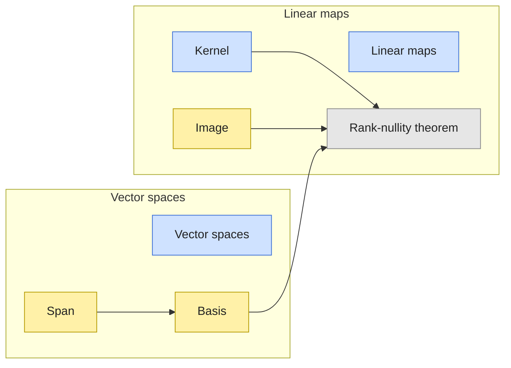

<!-- GENERATED by .lstack/lstack.mjs build on 2026-09-15. Do not hand-edit. -->
# Linear Algebra — prerequisite graph

```mermaid
flowchart LR
  classDef new fill:#e6e6e6,stroke:#888,color:#222
  classDef learning fill:#fff1a8,stroke:#b59b00,color:#222
  classDef reviewing fill:#cfe2ff,stroke:#3b6fd6,color:#222
  classDef mastered fill:#c8f0c8,stroke:#2e8b2e,color:#222
  subgraph sg_linear_maps["Linear maps"]
    linear_maps["Linear maps"]:::reviewing
    image["Image"]:::learning
    kernel["Kernel"]:::reviewing
    rank_nullity["Rank-nullity theorem"]:::new
  end
  subgraph sg_vector_spaces["Vector spaces"]
    vector_spaces["Vector spaces"]:::reviewing
    basis["Basis"]:::learning
    span["Span"]:::learning
  end
  kernel --> rank_nullity
  image --> rank_nullity
  basis --> rank_nullity
  span --> basis
```
